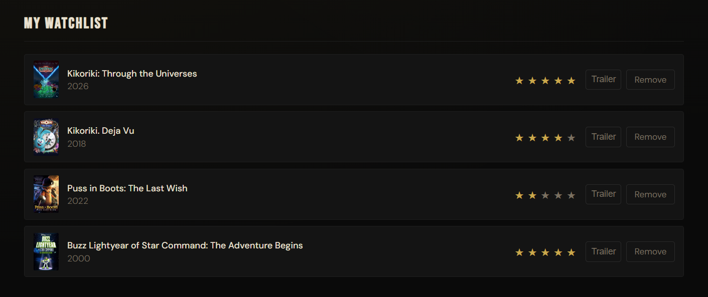

# Watchlist

Small fullstack project: TMDB search + per-user movie watchlist stored in
MongoDB. Built mainly to practice JWT auth, Redux Toolkit thunks, and
integrating a real third-party API.

[Live demo](https://watchlist-sigma-jade.vercel.app) · [README на русском](README.ru.md)

*Backend - the first request after long idle may take
a few extra seconds.*



**Stack:** React 19, TypeScript, Redux Toolkit · Node.js, Express 5, Mongoose, JWT, bcryptjs · MongoDB Atlas · Vercel + Railway

## What's actually built

- **Auth.** bcrypt cost 12. HS256 JWT, 24h expiry. `JWT_SECRET` length is
  checked at boot (must be 32+ chars) — the backend refuses to start otherwise.
- **Per-user data isolation.** Watchlist reads filter by `userId`; rating and
  delete use the composite Mongo filter `{ _id, userId }`, with `userId` taken
  from the JWT, never from the request body. Guessing someone else's item id
  returns 404, not 403, so item existence isn't leaked.
- **Server-side input validation.** ObjectId checked with
  `mongoose.Types.ObjectId.isValid` before touching the DB. Rating must be an
  integer 1-5. Watchlist payload goes through a type guard before insert.
- **TMDB search with race protection.** 350ms debounce, old in-flight requests
  aborted via `AbortController`. On top of that, the movies slice tracks
  `currentRequestId`: if a slow first request returns after a fast second one,
  its result is dropped at the reducer level — abort on the network side alone
  doesn't protect against a response already in flight.
- **Pending UI.** `pendingIds` / `removingIds` in the slice block duplicate
  add/remove clicks and show loading state while the request is in flight.
- **DB connection handling.** On long idle, the Mongo connection closes to
  free a slot on Atlas free tier (limit 500) and re-opens lazily on the next
  request; `app.listen()` keeps the process alive regardless.

## Why these choices

**MongoDB, honestly.** Picked it to get hands-on Mongoose experience. Two
collections without joins — Postgres would have worked equally well. Not a
document-shaped problem.

**JWT in localStorage.** Simpler flow. localStorage is vulnerable to XSS,
httpOnly cookies are vulnerable to CSRF and need CSRF tokens + SameSite on
top. For a pet project with no real PII I accepted the XSS trade-off. In
production: short-lived access token in memory + refresh token in an httpOnly
cookie with rotation.

**TMDB key in the frontend bundle.** `REACT_APP_*` vars are inlined at build
time, so the key is public. Proper fix is proxying `/search/movie` and
`/movie/:id/videos` through the backend and keeping the key server-side — on
the roadmap.

## Known gaps → plan

| Gap | Fix |
|---|---|
| No `helmet`, no rate limiting on `/auth/*` — credential stuffing unblocked | `express-rate-limit` + `helmet` |
| No composite unique index `{ userId, movieId }` — double-click in two tabs can duplicate | Add index + handle duplicate inserts |
| Email not normalized (`Vasya@x.com` ≠ `vasya@x.com`) | Normalize on register/login |
| TMDB key visible in frontend bundle | Backend proxy for TMDB calls |
| One frontend smoke test, no backend tests, no CI | Supertest for auth + IDOR resistance, slice tests for race handling, GitHub Actions |
| No retry/backoff on TMDB 429 | Add backoff, surface a clearer error |

<details>
<summary><b>Run locally</b></summary>

```bash
# backend
cd backend
cp .env.example .env
npm install
npm run dev                # :5000

# frontend, in a separate terminal
cd frontend
cp .env.example .env
npm install
npm start                  # :3000
```

**Backend `.env`:**

```env
MONGO_URI=<your Atlas connection string>
JWT_SECRET=<random 32+ chars>
PORT=5000
CLIENT_URL=http://localhost:3000
```

**Frontend `.env`:**

```env
REACT_APP_API_URL=http://localhost:5000
REACT_APP_TMDB_API_KEY=<your TMDB v3 key>
REACT_APP_TMDB_URL=https://api.themoviedb.org/3
```

TMDB key: https://www.themoviedb.org/settings/api

</details>

<details>
<summary><b>API reference</b></summary>

All `/watchlist/*` routes require `Authorization: Bearer <jwt>`.

| Method | Path | Body | Notes |
|---|---|---|---|
| POST | `/auth/register` | `{ email, password }` | password 6+ chars |
| POST | `/auth/login` | `{ email, password }` | returns `{ token, email }` |
| GET | `/watchlist` | - | current user's items |
| POST | `/watchlist` | `{ movieId, title, year?, poster_path? }` | validated server-side |
| PATCH | `/watchlist/:id/rating` | `{ rating: 1..5 }` | integer only |
| DELETE | `/watchlist/:id` | - | returns 404 if not owner |

</details>
