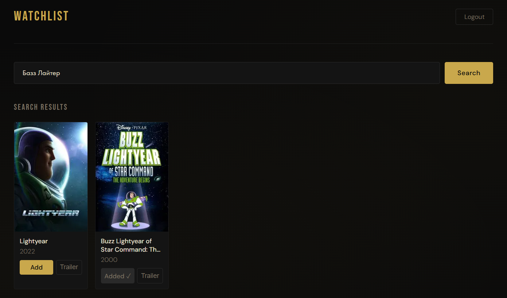
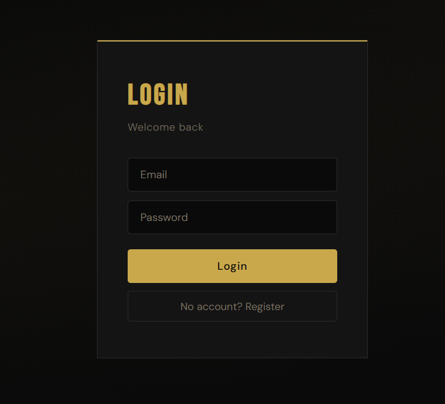

# Watchlist


Fullstack приложение для отслеживания фильмов на React, TypeScript и Node.js.

Ищи фильмы, добавляй в личный вотчлист и смотри трейлеры — всё в одном месте.

🔗 **[Live Demo](https://watchlist-sigma-jade.vercel.app)**

> Бэкенд работает на бесплатном тарифе Railway и может несколько секунд просыпаться после простоя.

---

## Зачем это сделано

Большинство приложений для фильмов — просто список названий без структуры.

Идея проекта простая: вотчлист должен работать как личная медиасистема, а не куча закладок.

- Разделяй то, что хочешь посмотреть, и то, что уже видел
- Находи и сохраняй фильмы не переключаясь между приложениями
- Смотри трейлеры не выходя из приложения
- Данные хранятся на сервере для каждого пользователя отдельно

---

## Основные возможности

### Поиск фильмов
Поиск в реальном времени через TMDB API. Результаты появляются по мере ввода.

### Личный список фильмов
Добавляй и удаляй фильмы. Данные хранятся в базе данных привязанными к аккаунту.

### Просмотр трейлеров
YouTube-трейлеры открываются прямо внутри приложения.

### Аутентификация
Регистрация и вход через JWT. У каждого пользователя изолированные данные.

### Адаптивный дизайн
Работает на мобильных и десктопе.

---

## Скриншоты

### Поиск


### Список фильмов


### Авторизация


---

## Стек технологий

| Слой | Технологии |
|------|-----------|
| Frontend | React, TypeScript, Redux Toolkit, Axios, TMDB API |
| Backend | Node.js, Express, TypeScript, MongoDB Atlas, Mongoose, JWT, bcryptjs |
| Деплой | Vercel (frontend) · Railway (backend) |

---

## Структура проекта

```
watchlist/
├── backend/
│   └── src/
│       ├── middleware/
│       ├── models/
│       ├── routes/
│       └── app.ts
└── frontend/
    └── src/
        ├── api/
        ├── app/
        ├── components/
        ├── features/
        │   ├── auth/
        │   ├── movies/
        │   └── watchlist/
        ├── pages/
        └── styles/
```

---

## Запуск локально

**Бэкенд**
```bash
cd backend
npm install
npm run dev
```

**Фронтенд**
```bash
cd frontend
npm install
npm start
```

**Переменные окружения**

Файл `.env` в папке backend:
```
MONGO_URI=строка_подключения_mongodb
JWT_SECRET=секретный_ключ
PORT=5000
```

Файл `.env` в папке frontend:
```
REACT_APP_API_URL=http://localhost:5000
REACT_APP_TMDB_API_KEY=ключ_tmdb
REACT_APP_TMDB_URL=https://api.themoviedb.org/3
```

---

[Read in English](README.md)
